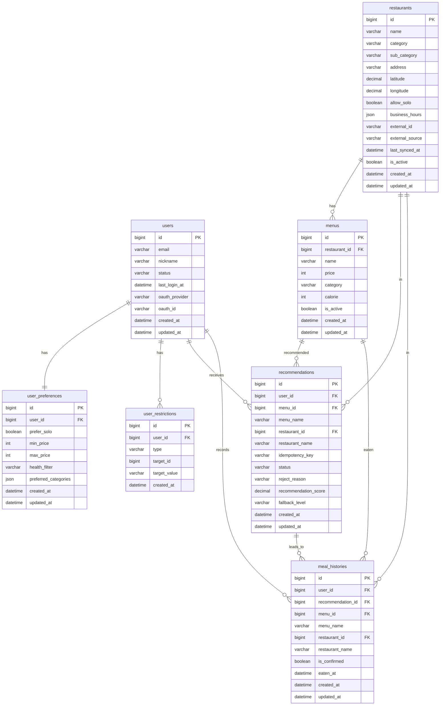

# Schema — ERD & 테이블 명세

> 이 파일은 초안이다. 실제 구현 시 업데이트해라.

## 1. ERD 다이어그램



---

## 2. 핵심 테이블 목록

| 테이블 | 설명 | Context |
|---|---|---|
| `users` | 사용자 기본 정보 | 사용자 프로필 |
| `user_preferences` | 취향, 건강 조건, 혼밥 여부 | 사용자 프로필 |
| `user_restrictions` | 싫어하는 메뉴/카테고리/식당 | 사용자 프로필 |
| `restaurants` | 식당 마스터 데이터 | 식당/메뉴 카탈로그 |
| `menus` | 메뉴 마스터 데이터 | 식당/메뉴 카탈로그 |
| `recommendations` | 추천 결과 기록 | 추천 / 추천 이력 |
| `meal_histories` | 사용자 실제 식사 기록 | 식사 이력 |
| `refresh_tokens` | JWT Refresh Token 영속 저장 (Redis 다운 fallback) | 사용자 프로필 |
| `places` | 내부화된 장소 데이터 | 장소/위치 |

---

## 3. 주요 테이블 구조 (초안)

### users

```sql
CREATE TABLE users (
    id              BIGINT          NOT NULL AUTO_INCREMENT,
    email           VARCHAR(255)    NOT NULL UNIQUE,
    nickname        VARCHAR(100)    NOT NULL,
    status          VARCHAR(20)     NOT NULL DEFAULT 'ACTIVE',  -- ACTIVE, INACTIVE, DELETED
    last_login_at   DATETIME,
    oauth_provider  VARCHAR(50),                                -- KAKAO, GOOGLE
    oauth_id        VARCHAR(255),                               -- 소셜 로그인 고유 ID
    password_hash  VARCHAR(255),  -- 일반 로그인용, 소셜 로그인 사용자는 NULL
    created_at      DATETIME        NOT NULL DEFAULT CURRENT_TIMESTAMP,
    updated_at      DATETIME        NOT NULL DEFAULT CURRENT_TIMESTAMP ON UPDATE CURRENT_TIMESTAMP,
    deleted_at      DATETIME        DEFAULT NULL,               -- NULL이면 활성, 값 있으면 탈퇴
    PRIMARY KEY (id)
);
```

### user_preferences

```sql
CREATE TABLE user_preferences (
    id                   BIGINT      NOT NULL AUTO_INCREMENT,
    user_id              BIGINT      NOT NULL UNIQUE,            -- 사용자당 1개만 허용
    prefer_solo          BOOLEAN     NOT NULL DEFAULT FALSE,  -- 혼밥 가능 여부
    min_price            INT,
    max_price            INT,
    health_filter        VARCHAR(50),                         -- NONE, LOW_CALORIE, VEGETARIAN
    preferred_categories JSON,                                -- ["KOREAN", "JAPANESE"]
    created_at           DATETIME    NOT NULL DEFAULT CURRENT_TIMESTAMP,
    updated_at           DATETIME    NOT NULL DEFAULT CURRENT_TIMESTAMP ON UPDATE CURRENT_TIMESTAMP,
    PRIMARY KEY (id),
    FOREIGN KEY (user_id) REFERENCES users(id)
);
```

> `preferred_categories`는 초기에는 JSON으로 관리한다.
> 카테고리 기반 복잡한 쿼리가 필요해지면 별도 테이블로 분리한다.

> `health_filter` 허용 값 (현재는 NONE만 사용, 나머지는 데이터 확보 후 적용 예정)

| 값 | 설명 | 적용 조건 |
|---|---|---|
| NONE | 건강 조건 없음 | 즉시 사용 가능 |
| LOW_CALORIE | 저칼로리 필터 | menus.calorie 데이터 확보 후 |
| HIGH_PROTEIN | 고단백 필터 | 단백질 데이터 확보 후 |
| VEGETARIAN | 채식 필터 | 재료 데이터 확보 후 |
| LIGHT | 자극 없는 음식 | 기준 정의 후 |

### user_restrictions

```sql
CREATE TABLE user_restrictions (
    id              BIGINT          NOT NULL AUTO_INCREMENT,
    user_id         BIGINT          NOT NULL,
    type            VARCHAR(50)     NOT NULL,    -- MENU, CATEGORY, RESTAURANT
    target_id       BIGINT,                      -- MENU, RESTAURANT 타입일 때 사용
    target_value    VARCHAR(50),                 -- CATEGORY 타입일 때 사용 (예: KOREAN)
    created_at      DATETIME        NOT NULL DEFAULT CURRENT_TIMESTAMP,
    PRIMARY KEY (id),
    FOREIGN KEY (user_id) REFERENCES users(id),
    INDEX idx_user_restrictions (user_id, type),
    CONSTRAINT chk_restriction_target CHECK (
        (type IN ('MENU', 'RESTAURANT') AND target_id IS NOT NULL)
        OR (type = 'CATEGORY' AND target_value IS NOT NULL)
    )
);
```

> 타입별 사용 컬럼
> - `type = MENU` → `target_id` (menus.id 참조)
> - `type = RESTAURANT` → `target_id` (restaurants.id 참조)
> - `type = CATEGORY` → `target_value` (예: "KOREAN", "JAPANESE")
>
> Preference는 추천 시 가중치(더 추천), Restriction은 필터(완전 제외)로 작동한다.
> 둘이 충돌하면 Restriction이 우선한다. (예: 한식 선호 + 매운 음식 제한 → 매운 한식 제외)

### restaurants

```sql
CREATE TABLE restaurants (
    id              BIGINT          NOT NULL AUTO_INCREMENT,
    name            VARCHAR(255)    NOT NULL,
    category        VARCHAR(100)    NOT NULL,            -- KOREAN, JAPANESE, CHINESE, WESTERN (대표 카테고리)
    sub_category    VARCHAR(100),                        -- 세부 음식 종류 (카카오 카테고리 3단계, 예: "육류,고기", "초밥,롤")
    address         VARCHAR(500),
    latitude        DECIMAL(10, 7)  NOT NULL,
    longitude       DECIMAL(10, 7)  NOT NULL,
    allow_solo      BOOLEAN         NOT NULL DEFAULT TRUE,
    business_hours  JSON,                                -- {"MON": "09:00-22:00", "SUN": "휴무"}
    external_id     VARCHAR(255),                        -- 카카오/네이버 등 외부 ID
    external_source VARCHAR(50),                         -- KAKAO, NAVER, PUBLIC_DATA
    last_synced_at  DATETIME,                            -- 외부 API 마지막 동기화 시간
    is_active       BOOLEAN         NOT NULL DEFAULT TRUE,
    created_at      DATETIME        NOT NULL DEFAULT CURRENT_TIMESTAMP,
    updated_at      DATETIME        NOT NULL DEFAULT CURRENT_TIMESTAMP ON UPDATE CURRENT_TIMESTAMP,
    deleted_at      DATETIME        DEFAULT NULL,         -- NULL이면 운영 중, 값 있으면 폐업/삭제
    PRIMARY KEY (id),
    UNIQUE KEY uq_external (external_source, external_id) -- 동일 외부 소스 중복 식당 방지
);
```

> `is_active`: 임시 비활성 (영업 중단, 점검 등)
> `deleted_at`: 영구 삭제 (폐업, 데이터 제거) — 소프트 딜리트

### menus

```sql
CREATE TABLE menus (
    id              BIGINT          NOT NULL AUTO_INCREMENT,
    restaurant_id   BIGINT          NOT NULL,
    name            VARCHAR(255)    NOT NULL,
    price           INT             NOT NULL,
    category        VARCHAR(100),                         -- 상세 카테고리 (추천 필터링 기준으로 우선 사용)
    calorie         INT,
    is_active       BOOLEAN         NOT NULL DEFAULT TRUE,
    created_at      DATETIME        NOT NULL DEFAULT CURRENT_TIMESTAMP,
    updated_at      DATETIME        NOT NULL DEFAULT CURRENT_TIMESTAMP ON UPDATE CURRENT_TIMESTAMP,
    deleted_at      DATETIME        DEFAULT NULL,         -- NULL이면 판매 중, 값 있으면 영구 삭제
    PRIMARY KEY (id),
    FOREIGN KEY (restaurant_id) REFERENCES restaurants(id)
);
```

> `is_active`: 임시 품절/비활성
> `deleted_at`: 영구 삭제 — 소프트 딜리트
> `menu.category`를 추천 필터링 기준으로 우선 사용한다. `restaurant.category`는 식당 탐색 시 사용하는 대표 카테고리다.

### recommendations

```sql
CREATE TABLE recommendations (
    id                   BIGINT          NOT NULL AUTO_INCREMENT,
    user_id              BIGINT          NOT NULL,
    menu_id              BIGINT,                                  -- ON DELETE SET NULL, 소프트 딜리트 시 NULL 처리
    menu_name            VARCHAR(255)    NOT NULL,                -- 메뉴 삭제 시 이름 보존
    restaurant_id        BIGINT,                                  -- ON DELETE SET NULL, 소프트 딜리트 시 NULL 처리
    restaurant_name      VARCHAR(255)    NOT NULL,                -- 식당 삭제 시 이름 보존
    idempotency_key      VARCHAR(255)    NOT NULL,                -- 멱등성은 Redis에서 관리
    status               VARCHAR(50)     NOT NULL,
    reject_reason        VARCHAR(50),                             -- TOO_FAR, NOT_HUNGRY, PREFER_SOLO, OTHER
    recommendation_score DECIMAL(5,2),                           -- 추천 점수 (0~100점)
    fallback_level       VARCHAR(20),                             -- LEVEL_1, LEVEL_2, LEVEL_3, LEVEL_4
    created_at           DATETIME        NOT NULL DEFAULT CURRENT_TIMESTAMP,
    updated_at           DATETIME        NOT NULL DEFAULT CURRENT_TIMESTAMP ON UPDATE CURRENT_TIMESTAMP,
    PRIMARY KEY (id),
    INDEX idx_user_created_at (user_id, created_at),
    INDEX idx_idempotency_key (idempotency_key),
    CONSTRAINT chk_recommendation_status
        CHECK (status IN ('RECOMMENDED', 'ACCEPTED', 'REJECTED'))
);
```

> `idempotency_key`에 UNIQUE를 걸지 않는 이유: Redis TTL 만료 후 동일 키로 재요청이 올 수 있다.
> DB UNIQUE를 걸면 재시도 흐름이 깨진다. 멱등성은 Redis에서만 관리한다.

### meal_histories

```sql
CREATE TABLE meal_histories (
    id                  BIGINT          NOT NULL AUTO_INCREMENT,
    user_id             BIGINT          NOT NULL,
    recommendation_id   BIGINT,                                  -- 추천을 통해 먹은 경우
    menu_id             BIGINT,
    menu_name           VARCHAR(255)    NOT NULL,                -- 메뉴 삭제 시 이름 보존
    restaurant_id       BIGINT,
    restaurant_name     VARCHAR(255)    NOT NULL,                -- 식당 삭제 시 이름 보존
    is_confirmed        BOOLEAN         NOT NULL DEFAULT FALSE,  -- 먹었어요 버튼 눌렀는지 여부
    eaten_at            DATETIME        NOT NULL,                -- 날짜+시간 (점심/저녁 구분 가능)
    created_at          DATETIME        NOT NULL DEFAULT CURRENT_TIMESTAMP,
    updated_at          DATETIME        NOT NULL DEFAULT CURRENT_TIMESTAMP ON UPDATE CURRENT_TIMESTAMP,
    PRIMARY KEY (id),
    INDEX idx_user_eaten_at (user_id, eaten_at),
    CONSTRAINT chk_meal_source CHECK (
        recommendation_id IS NOT NULL
        OR (menu_id IS NOT NULL AND restaurant_id IS NOT NULL)
    )
);
```

> `is_confirmed = TRUE`: 먹었어요 버튼 누름 → 3일간 완전 제외
> `is_confirmed = FALSE`: 버튼 안 누름 → 2일간 추천 점수 감소만 적용

### refresh_tokens

```sql
CREATE TABLE refresh_tokens (
    id          BIGINT          NOT NULL AUTO_INCREMENT,
    user_id     BIGINT          NOT NULL UNIQUE,                 -- 사용자당 1개 토큰
    token       VARCHAR(512)    NOT NULL,
    expires_at  DATETIME        NOT NULL,
    created_at  DATETIME        NOT NULL DEFAULT CURRENT_TIMESTAMP,
    updated_at  DATETIME        NOT NULL DEFAULT CURRENT_TIMESTAMP ON UPDATE CURRENT_TIMESTAMP,
    PRIMARY KEY (id),
    FOREIGN KEY (user_id) REFERENCES users(id),
    INDEX idx_expires_at (expires_at)
);
```

> Source of Truth로 DB 사용. Redis는 Cache-aside 캐시 레이어 (성능).
> Redis 다운 시에도 사용자 강제 로그아웃 방지 — `CachedRefreshTokenAdapter`가 DB로 fallback.

---

## 4. 인덱스 전략

| 테이블 | 인덱스 | 이유 |
|---|---|---|
| `recommendations` | `(user_id, created_at)` | 최근 추천 이력 조회 |
| `recommendations` | `(user_id, status)` | 상태별 추천 이력 조회 (ACCEPTED, REJECTED 필터링) |
| `recommendations` | `idempotency_key` INDEX | 멱등성 키 조회 (UNIQUE 제거 — 멱등성은 Redis에서 관리) |
| `meal_histories` | `(user_id, eaten_at)` | 최근 식사 이력 조회 |
| `meal_histories` | `(user_id, is_confirmed)` | 확정/미확정 식사 이력 빠른 조회 |
| `restaurants` | `(latitude, longitude)` | 초기에는 일반 인덱스 사용. 월 활성 사용자 10만 초과 또는 위치 쿼리 응답 500ms 초과 시 SPATIAL INDEX 또는 Redis GEO로 전환 |
| `menus` | `(restaurant_id)` | 식당별 메뉴 조회 시 Full Scan 방지 |
| `user_restrictions` | `(user_id, type)` | 사용자별 제한 조건 빠른 조회 |
| `refresh_tokens` | `user_id` UNIQUE | 사용자당 1개 토큰 보장 + 빠른 조회 |
| `refresh_tokens` | `expires_at` | 만료 토큰 일괄 삭제 배치 (선택 구현) |

---

## 5. 업데이트 필요 사항

- [x] 실제 ERD 다이어그램 첨부 (mermaid)
- [x] 소프트 딜리트 (`deleted_at`) 적용 범위 결정 (users, restaurants, menus)
- [ ] 위치 기반 조회 성능 개선 검토 — 트래픽 증가 시 `SPATIAL INDEX` 또는 Redis Geospatial로 대체 고려
- [ ] 샤딩/파티셔닝 전략 (사용자 수 증가 시)